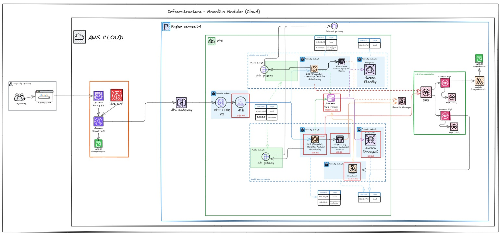

# Marketplace Golden Bears

Marketplace Golden Bears es una plataforma de comercio electrónico que opera bajo el modelo de marketplace con fulfillment centralizado, permitiendo a los usuarios explorar y adquirir productos de múltiples marcas aliadas en un solo entorno digital. El sistema atiende tanto a usuarios no autenticados como a clientes registrados, con alcance a nivel nacional incluyendo provincias.

Actualmente se encuentra en una etapa inicial de crecimiento, gestionando entre 5,000 y 7,000 visitas mensuales con picos de actividad entre las 16:00 y 20:00 horas. Frente a limitaciones de escalabilidad en la infraestructura tradicional, se propone la migración a una solución en la nube diseñada para garantizar alta disponibilidad, resiliencia y capacidad de respuesta ante eventos de alta concurrencia como campañas tipo Black Friday.

## Descripcion General

La plataforma permite a usuarios registrados y no registrados explorar productos de múltiples marcas aliadas. Entre sus capacidades principales:

- Navegación de catálogo sin autenticación
- Registro, autenticación y gestión de cuenta de cliente
- Carrito de compras y proceso de checkout con múltiples métodos de pago
- Gestión de órdenes y comprobantes
- Panel de administración para gestión de productos, marcas, categorías y usuarios

## Arquitectura



La plataforma implementa una arquitectura de monolito modular desplegada en AWS, diseñada para soportar picos de tráfico de hasta 10,000 visitas durante campañas de alta demanda.

### Componentes por Capa

**Distribución y Seguridad**
- Route 53 para resolución DNS
- CloudFront como CDN y punto de entrada
- WAF para protección contra ataques y rate limiting
- S3 para hosting del frontend estático

**API y Balanceo**
- API Gateway con VPC Link V2
- Application Load Balancer (ALB)

**Cómputo**
- ECS Fargate con Auto Scaling (Monolito Modular) en dos zonas de disponibilidad
- Lambda para procesamiento de comprobantes y validaciones

**Base de Datos**
- Aurora PostgreSQL Principal + Standby (Multi-AZ)
- Amazon RDS Proxy
- ElastiCache Redis para caché

**Mensajería**
- SNS + SQS + Dead Letter Queue para procesamiento asíncrono de órdenes y comprobantes

**Seguridad y Configuración**
- Secrets Manager para gestión de credenciales
- IAM para control de acceso

## Requisitos Previos

- [Docker Desktop](https://www.docker.com/products/docker-desktop/) instalado y corriendo
- [Git](https://git-scm.com/)

## Levantar el proyecto localmente

### 1. Clonar el repositorio

```bash
git clone https://github.com/CastAlX7/E-Commerce-GoldenBears.git
cd E-Commerce-GoldenBears
git checkout develop
```

### 2. Configurar variables de entorno
**Windows:**

```bash
copy backend\.env.example backend\.env
```

**Mac/Linux:**

```bash
cp backend/.env.example backend/.env
```

### 3. Levantar los contenedores

```bash
docker compose up --build -d
```
> La primera vez tarda ~2-3 minutos descargando imágenes y construyendo los contenedores.

### 4. Cargar datos de prueba

```bash
docker compose exec backend python seed.py
```

### 5. Abrir en el navegador

http://localhost

| Acción | Comando |
|---|---|
| Detener contenedores | `docker compose down` |
| Reset completo (borra todos los datos) | `docker compose down -v` |
